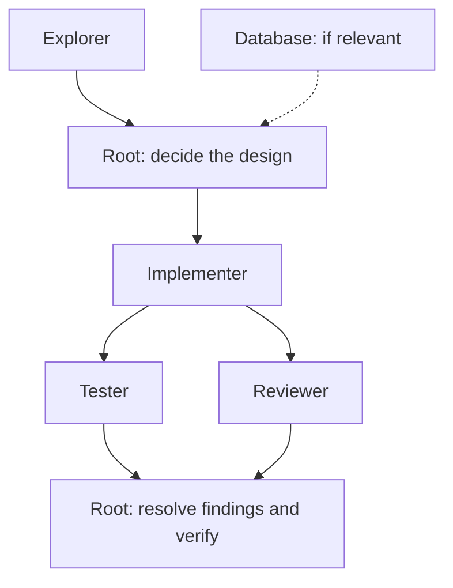
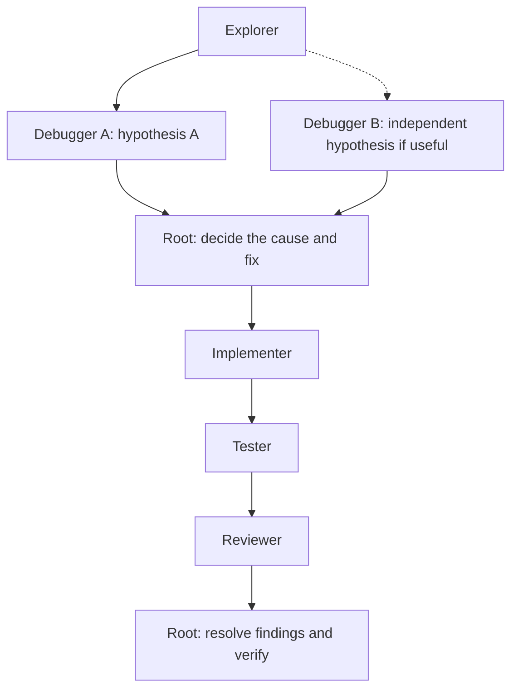
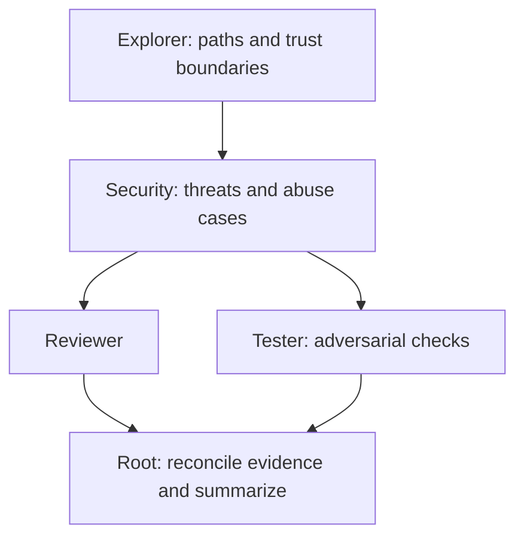

# Agent Rig

Reusable engineering workflows for **Codex** and **Claude Code**. Agent Rig installs specialist agents, workflow instructions, and presets into your projects or provider configuration directory.

The root agent owns the result: it chooses the design, delegates bounded work, reconciles findings, and verifies completion. Substantial changes get independent testing and review; simple changes stay with root.

**Rig is opt-in for each request.** Start a prompt with `@feature`, `@bug`, `@review`, `@security`, or `@quick` to activate it. Unprefixed requests use your existing setup.

[Quick start](#quick-start) · [Providers](#providers) · [Presets](#presets) · [Workflows](#workflows) · [Model policies](#model-policies) · [Updates and removal](#updates-and-removal) · [Customization](#customization) · [Development](#development)

## Quick start

Run the command for your provider from this checkout. The target project directory must already exist:

```bash
# Codex; --provider codex is also the default when omitted.
bin/agent-rig install --provider codex --target /path/to/project

# Claude Code.
bin/agent-rig install --provider claude --target /path/to/project
```

Run both commands against the same project to install both providers. Each defaults to the **full preset**: seven roles and five workflows. Add `--preset minimal`, `--preset backend`, or `--preset security` for a smaller set. Add `--dry-run` to preview changes without writing.

Before writing, the installer shows the provider, project/global scope, destination, preset, and planned file changes, then asks `Continue with installation? [y/N]`. Enter `yes` to proceed or `no` (or press Enter) to cancel. When the selected provider already has configuration, the summary explains that Rig merges its agents and managed instructions into the setup while preserving existing provider settings and surrounding instructions. Updates and preset changes also require confirmation; dry runs and unchanged installations do not prompt.

Terminal output uses colors and a progress bar that tracks completed file changes. Set `NO_COLOR=1` to disable colors. Redirected output and `TERM=dumb` use plain text with start/end progress lines. For unattended installs, explicitly accept the plan with `--yes` (or `-y`):

```bash
bin/agent-rig install --provider codex --target /path/to/project --yes
```

Without `--yes`, an install that needs changes stops without writing if no confirmation input is available.

Start a new session of the selected provider in the target project, then make a request:

```text
@feature Add employee bonus calculations.
@bug Investigate why this payroll total is incorrect.
@review Review the latest changes.
@security Assess the authentication flow.
@quick Fix the typo in README.md.
```

Each line above is a separate example request. Installing roles makes them available; root uses only the specialists relevant to the task.

The installer requires **Bash 3.2+ and standard Unix utilities**. Use a provider release that supports its native agent files and the configured model/effort fields. Account model access and session permissions still apply.

### Install globally

Use `--global` instead of `--target` to make Rig available across projects:

```bash
bin/agent-rig install --provider codex --global --preset backend
bin/agent-rig install --provider claude --global --preset backend
```

| Provider | Global directory | Environment override |
| --- | --- | --- |
| Codex | `~/.codex` | `CODEX_HOME` |
| Claude Code | `~/.claude` | `CLAUDE_CONFIG_DIR` |

Custom directories work in both install and uninstall commands:

```bash
CODEX_HOME=/path/to/codex-home bin/agent-rig install --provider codex --global
CLAUDE_CONFIG_DIR=/path/to/claude-home bin/agent-rig install --provider claude --global
```

`--global` and `--target` are mutually exclusive. A missing global directory is created only when applying an install; a dry run creates no destination files or directories. Global workflow paths are absolute. If you relocate a provider home, rerun installation to refresh them.

When a project and a global Rig installation are both present for the same provider, the Rig instructions select the project's preset, role list, and workflow paths. Repository conventions still govern the work.

## Providers

Both providers expose the same role, workflow, and preset names. Their native files, orchestration instructions, models, and installation state are independent.

| | Codex | Claude Code |
| --- | --- | --- |
| Project instructions | `AGENTS.md`, or an active `AGENTS.override.md` | `CLAUDE.md` |
| Project agents | `.codex/agents/agent_rig_<role>.toml` | `.claude/agents/agent-rig-<role>.md` |
| Agent format | Native TOML | Native Markdown with YAML frontmatter, rendered from provider templates |
| Rig state | `.agent-rig/codex/` | `.agent-rig/claude/` |
| Sources | [providers/codex/](providers/codex/) | [providers/claude/](providers/claude/) |

A project with both installed has this layout:

```text
project/
├── AGENTS.md                         # Or active AGENTS.override.md
├── CLAUDE.md
├── .codex/
│   ├── config.toml                   # Existing settings preserved
│   └── agents/agent_rig_<role>.toml
├── .claude/
│   └── agents/agent-rig-<role>.md
└── .agent-rig/
    ├── codex/
    │   ├── workflows/<workflow>.md
    │   ├── manifest.tsv
    │   └── backups/<run>/            # Created when existing files change
    └── claude/
        ├── workflows/<workflow>.md
        ├── models/policy.tsv
        ├── manifest.tsv
        └── backups/<run>/
```

Global installations use `agents/` directly inside the selected provider home, along with its instruction file and `.agent-rig/<provider>/` state.

Installing, updating, removing, or rolling back one provider preserves the other provider's files. Each has its own manifest, backups, and install/uninstall lock. Claude does not import Codex instructions, and neither provider consumes the other's model policy.

### Existing configuration

**Codex:** existing project `.codex/config.toml` and global `config.toml` remain byte-for-byte unchanged. If absent, Rig creates comment-only guidance. If your setup disables multi-agent tools and you want Rig delegation, reconcile `enabled = true` in the existing `[agents]` table, or add the table if absent. Avoid duplicate tables. See [configuration guidance](providers/codex/templates/config.toml) and the [Codex subagent reference](https://learn.chatgpt.com/docs/agent-configuration/subagents).

The Codex installer uses a nonempty `AGENTS.override.md` when present; otherwise it uses `AGENTS.md` and leaves empty or whitespace-only overrides untouched. A later install moves the managed section if an override becomes active, preserving surrounding instructions in both files. This applies to project and global installations; see the [instruction discovery reference](https://learn.chatgpt.com/docs/agent-configuration/agents-md).

**Claude Code:** Rig preserves settings JSON, permissions, hooks, skills, and memory configuration. Explorer, database, reviewer, and security have only Read, Grep, and Glob tools. Implementer and tester can edit assigned files and execute checks; debugger can run safe checks without editing source. Rig uses native subagents within one root session. See the [Claude subagent reference](https://code.claude.com/docs/en/sub-agents) and [instruction file reference](https://code.claude.com/docs/en/memory).

## Presets

A preset selects which roles and workflows are installed for either provider:

| Preset | Available roles | Available workflows |
| --- | --- | --- |
| `minimal` | explorer, implementer, tester, reviewer | feature, bug, quick |
| `backend` | explorer, implementer, database, tester, reviewer, debugger | feature, bug, review, quick |
| `security` | explorer, security, reviewer, tester, debugger | security, review, bug, quick |
| `full` (default) | all seven roles | feature, bug, review, security, quick |

Root handles a stage when its specialist is absent. For example, minimal leaves uncertain diagnosis with root, while security leaves implementation with root. An unavailable review or assessment workflow does not authorize implementation; root adapts the process to the requested outcome.

Definitions are maintained separately in [Codex presets](providers/codex/presets/) and [Claude presets](providers/claude/presets/).

## Workflows

The standalone alias must appear at the beginning of the request, after optional whitespace. Aliases are prompt conventions, not native provider commands. Quoting an alias or mentioning it later does not activate Rig. Activation is evaluated again for every request.

| Alias | Use for | Normal stages |
| --- | --- | --- |
| `@feature` | Non-trivial feature development | Explore → root design → implement → independent testing/review → root verification |
| `@bug` | A failure whose cause needs investigation | Explore → investigate hypotheses → root diagnosis → implement → test → review |
| `@review` | Existing code or a proposed change | Relevant reviewers → root summary |
| `@security` | Security assessment | Explore → security analysis → independent review/testing → root summary |
| `@quick` | Trivial or low-risk changes | Root inspects → edits → verifies |

### Feature

Root decides the design and assigns file ownership before implementation. Database analysis participates only when persistence concerns are relevant.



Tester and reviewer may run in parallel once implementation stabilizes, with test writes outside the review target. Accepted fixes and subsequent tests receive affected testing and follow-up review.

Workflow definitions: [Codex feature](providers/codex/workflows/feature.md) · [Claude feature](providers/claude/workflows/feature.md).

### Bug

Establish expected behavior and a reproduction, then investigate discriminating hypotheses before applying a fix.



Debugger A and B are separate instances of the same role. Use a second instance when it adds independent evidence. Root investigates when debugger is absent; an obvious low-risk fix can use quick.

Workflow definitions: [Codex bug](providers/codex/workflows/bug.md) · [Claude bug](providers/claude/workflows/bug.md).

### Review and security

Review examines a stable target and adds security or database expertise only when relevant. Root reconciles evidence and ranks actionable findings. Review and security assessments report findings and recommendations; persistent fixes or test edits require a request for changes.

Security adds independent review and adversarial testing:



Assessment-only testing uses existing checks or disposable reproductions without persistent source edits. Findings are ranked CRITICAL, HIGH, MEDIUM, or LOW and include evidence, impact, and limitations. Agents should state when no meaningful issues are found.

Workflow definitions: [Codex review](providers/codex/workflows/review.md) · [Claude review](providers/claude/workflows/review.md) · [Codex security](providers/codex/workflows/security.md) · [Claude security](providers/claude/workflows/security.md).

### Quick and coordination

Quick stays root-only for typos, small documentation edits, bounded mechanical renames, and obvious configuration corrections. If inspection reveals broader effects or uncertainty, root explains a change to the smallest suitable workflow.

Across workflows, root assigns bounded tasks with context and explicit file ownership. Independent analysis can run in parallel; overlapping edits are sequenced. Testing and review stay independent of implementation. Root reconciles findings, coordinates corrections, and performs final verification within the runtime's concurrency limits.

Plan Mode stays planning, including delegated work. Project conventions, user instructions, and existing permission boundaries continue to apply. Codex nested delegation requires explicit root authorization and a clear benefit; Claude Rig subagents return to root without spawning more agents.

Workflow definitions: [Codex quick](providers/codex/workflows/quick.md) · [Claude quick](providers/claude/workflows/quick.md).

### Specialist roles

| Role | Responsibility | Expected result |
| --- | --- | --- |
| explorer | Trace architecture, execution paths, dependencies, and conventions | Relevant files, constraints, risks, and implementation areas |
| implementer | Carry out the root-approved design within assigned files | Scoped changes, checks, and remaining concerns |
| database | Analyze schema, SQL, migrations, indexes, transactions, and integrity | Persistence findings, design tradeoffs, and verification recommendations |
| tester | Independently check requirements, edge cases, regressions, and failures | Test scenarios, commands/results, defects, and coverage gaps |
| debugger | Investigate one bounded failure hypothesis | Supporting/contradicting evidence, diagnosis, and smallest fix recommendation |
| reviewer | Independently inspect a stable implementation | Actionable ranked findings, or a clear report of no findings |
| security | Assess reachable threats, trust boundaries, and abuse cases | Evidence-backed findings, mitigations, and adversarial scenarios |

Agent definitions: [Codex agents](providers/codex/agents/) · [Claude agent templates](providers/claude/agents/).

## Model policies

Model selection belongs to each provider. The user's root model and effort remain unchanged, including for quick. Role defaults apply when a Rig specialist is delegated an activated task; local native overrides are protected on future installs.

### Codex defaults

Codex roles specify `model` and `model_reasoning_effort` in their TOML files:

| Roles | Model | Effort |
| --- | --- | --- |
| explorer | `gpt-6-luna` | high |
| implementer, database, tester | `gpt-6.1-sol` | high |
| debugger, reviewer, security | `gpt-6-astra` | high |

These are the shipped starting defaults, not per-role benchmark results. Customize the native role files; removing both model and effort keys restores inheritance. See [Codex model policy](providers/codex/models/README.md) and the [configuration reference](https://learn.chatgpt.com/docs/config-file/config-reference).

### Claude defaults

[policy.tsv](providers/claude/models/policy.tsv) centrally defines Claude role tiers, pinned IDs, effort defaults, pricing metadata, and quality targets. Installation renders explicit native model/effort fields into each agent and records a policy copy in `.agent-rig/claude/models/policy.tsv`.

| Tier | Roles | Pinned model | Effort |
| --- | --- | --- | --- |
| FAST | explorer | `claude-haiku-4-5-20251001` | omitted; unsupported |
| BALANCED | implementer, database, tester, debugger | `claude-sonnet-5-5` | medium |
| STRONG | reviewer, security | `claude-opus-5-5` | high |
| ESCALATION | exceptional bounded attempts only | `claude-fable-5-1` | high for definitions using this tier |

All presets share this policy. Escalation is an explicit, bounded response to unresolved evidence or high-impact risk, and is absent from normal workflow stages. A native model override does not automatically change the role's effort. Rig does not silently upgrade pins during installation.

The policy was reviewed on October 5, 2026. Its quality thresholds are initial targets; live benchmarks are needed to establish the cheapest reliable model for each role. See [Claude policy details, pricing, and escalation rules](providers/claude/models/README.md) and the [benchmark suite](providers/claude/benchmarks/README.md). Account and runtime restrictions can override requested models; record the actual selection during evaluation.

## Updates and removal

Repeat install from this checkout to update a provider or switch its preset:

```bash
bin/agent-rig install --provider claude --target /path/to/project --preset backend --dry-run
bin/agent-rig install --provider claude --target /path/to/project --preset backend
```

Use `--provider codex` for Codex, or `--global` instead of `--target` for a global installation. **Omitting `--preset` selects full, including on updates.** An unchanged repeat install is a no-op.

### Local edits and backups

The selected provider's manifest records ownership and checksums for managed agents, workflows, instruction sections, and any generated policy. Updates preserve existing configuration and instructions outside Rig sections. Missing managed files are recreated; a removed instruction section remains a protected local change.

| Situation | Behavior |
| --- | --- |
| Managed content is unchanged or already matches the new output | Update or adopt the matching content |
| Managed content has differing local edits, or an unmanaged destination conflicts | Stop before writing; report conflicts |
| `--replace-modified` is supplied to install | Back up conflicting content and apply replacement or preset removal |
| Preset drops a previously managed role/workflow | Remove that tracked content, subject to local-edit protection |
| Markers/manifest are malformed, paths are unsafe, scopes conflict, or destinations are symlinks | Stop; replacement flags do not bypass these checks |

```bash
bin/agent-rig install --provider claude --target /path/to/project --preset backend --replace-modified
```

Every existing file changed or deleted is backed up under `.agent-rig/<provider>/backups/<run>/`; the command reports the directory. Install and uninstall stage changes, share the provider's lock, and attempt to restore originals on write failure. Backups are retained; empty directories may remain. Avoid editing destinations during a run. Before removing a leftover `.install-lock`, confirm no operation is running.

### Uninstall

```bash
# Preview and remove one provider from a project.
bin/agent-rig uninstall --provider claude --target /path/to/project --dry-run
bin/agent-rig uninstall --provider claude --target /path/to/project

# Remove Codex from its global directory.
bin/agent-rig uninstall --provider codex --global

# Back up and remove locally customized Rig content explicitly.
bin/agent-rig uninstall --provider claude --target /path/to/project --remove-modified
```

Uninstall removes recorded managed files, the marked instruction section, and the manifest. It preserves instructions outside the section byte-for-byte, unrelated files, configuration, and backup history. Empty instruction files and directories may remain. Additional Codex Rig sections in the other instruction file require explicit removal through `--remove-modified`.

Already missing managed content is accepted. Without a manifest, uninstall leaves the destination untouched rather than guessing ownership. A missing global directory is not created by removal. Removing a project installation leaves its global installation intact, and removing one provider leaves the other intact. Start a new provider session afterward.

`--replace-modified` is for install; `--remove-modified` is for uninstall. Run `bin/agent-rig --help` for the complete command options.

### Legacy Codex migration

An existing `.agent-rig/manifest.tsv` identifies a legacy Codex installation. The next Codex install validates recorded ownership and local edits, moves tracked workflows to `.agent-rig/codex/workflows/`, refreshes instruction paths, and replaces the old manifest with `.agent-rig/codex/manifest.tsv`. Earlier managed generic role names are migrated to the `agent_rig_` namespace.

Changed or removed files are backed up in the new Codex backup directory. Old `.agent-rig/backups/` history and untracked content stay in place. A dry run previews migration without writing; local edits remain protected. Migration takes both the legacy and new Codex locks. If both manifests exist, reconcile them manually before proceeding.

Codex uninstall can remove legacy state directly. Claude operations leave that state untouched. If an older Rig installation enabled multi-agent tools in Codex configuration, remove that setting manually when you prefer inherited settings; the installer preserves existing configuration.

## Customization

Keep repository conventions and project-specific requirements outside the Rig markers in `AGENTS.md`, the active `AGENTS.override.md`, or `CLAUDE.md`:

```markdown
# Project instructions

Run the project's test command. Follow its API conventions.

<!-- agent-rig:begin -->
...installed Rig instructions...
<!-- agent-rig:end -->

Additional project instructions can go here.
```

Updates preserve content outside the managed section byte-for-byte, including CRLF line endings. Edits inside the section, even line-ending changes, remain protected local modifications. Relative project workflow paths resolve against the file containing the Rig section, including when a session starts in a project subdirectory.

Edit installed native agents and workflows to customize one project or global setup. For Claude model overrides, edit native frontmatter; editing the installed policy copy alone does not re-render agents. Change provider source assets to set defaults for future installs. Claude source agents contain model/effort placeholders and must be rendered by installation before use.

Commit installed instructions, agents, workflows, policy copies, and manifests when teammates should share the setup. Keep backups and temporary locks out of project version control, for example:

```gitignore
.agent-rig/*/backups/
.agent-rig/*/.install-lock/
```

The installer does not edit the target project's `.gitignore`. Keep legacy backup history ignored too if that project has an older installation.

## Development

Provider-specific implementation lives under separate source trees:

```text
bin/agent-rig                         # Shared installation lifecycle
providers/
├── codex/{agents,workflows,presets,templates,models}/
└── claude/{agents,workflows,presets,templates,models,benchmarks}/
tests/
├── codex/
└── claude/
```

Each trusted `provider.sh` adapter owns native paths, rendering, instruction discovery, configuration handling, and ownership patterns. Core manages provider selection, presets, conflict handling, manifests, backups, locks, and rollback without parsing native agent syntax. Provider validators check their own formats.

### Automated checks

Development checks require Make and Python 3.11+:

```bash
make check
```

The suite validates native agent output, presets, references, Markdown links/fences, and source formatting. Disposable project and global fixtures cover installation confirmation, terminal colors and progress, updates, removal, coexistence, legacy migration, protected edits, model policy rendering, preserved instruction bytes, unsafe-path rejection, locks, and injected failures that exercise rollback. It does not change your actual provider installations or call models.

To run checks individually:

```bash
python3 tests/validate.py
python3 tests/installer.py
bash tests/codex/install.sh
bash tests/codex/uninstall.sh
bash tests/codex/migration.sh
bash tests/claude/install.sh
bash tests/claude/models.sh
python3 providers/claude/benchmarks/evaluate.py --check
python3 tests/claude/benchmarks.py
```

### Runtime smoke checks and benchmarks

Install minimal into a disposable project, start a new authenticated provider session, and request exploration without edits:

```text
@feature Explore this repository and propose a feature plan without edits.
Use the installed Rig explorer to identify relevant files, report available
roles and workflows, and wait for its findings.
```

Confirm the namespaced explorer runs and returns evidence. Try quick on a documentation change and confirm root handles it alone. Then make an unprefixed request and confirm the existing process applies. For Claude, also try a small feature with independent testing and review; inspect agent definitions through `/agents` or ask the session to list them. Repeat with a nested working directory and a global installation when applicable.

Automated checks validate configuration and lifecycle behavior; authenticated sessions verify real delegation and model access. The [Claude benchmark guide](providers/claude/benchmarks/README.md) describes seven seeded role tasks, independent grading, and reporting for latency, tool reliability, cache-aware costs, retries, failed workflows, and root verification. Passing offline checks does not establish live model quality.
