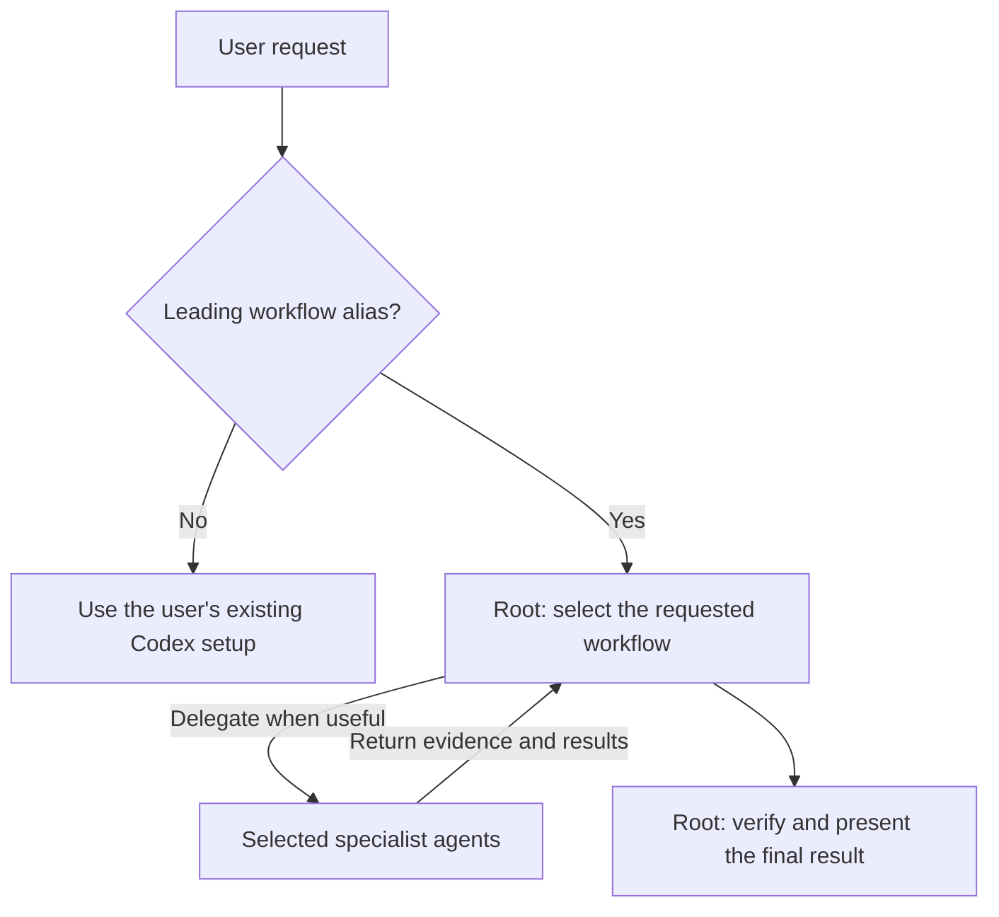
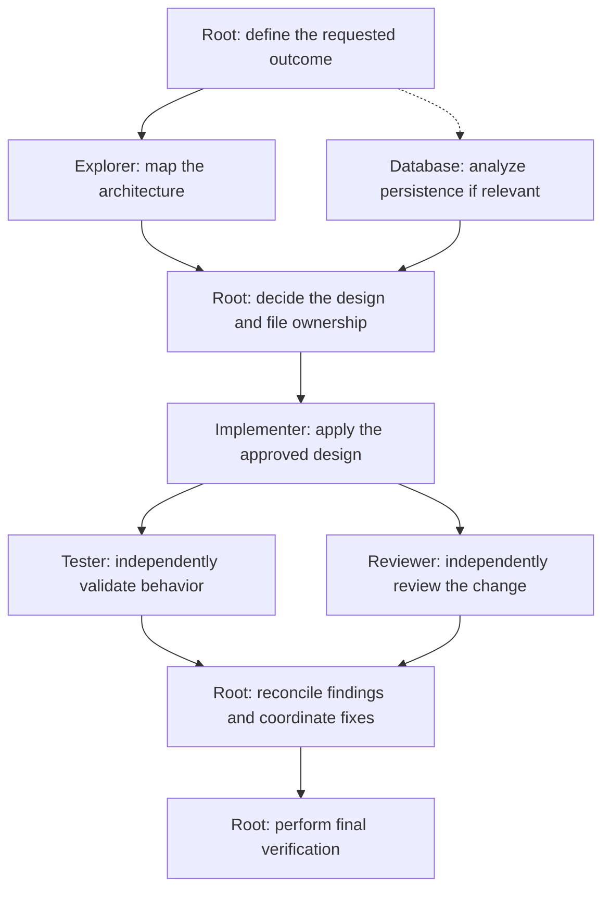
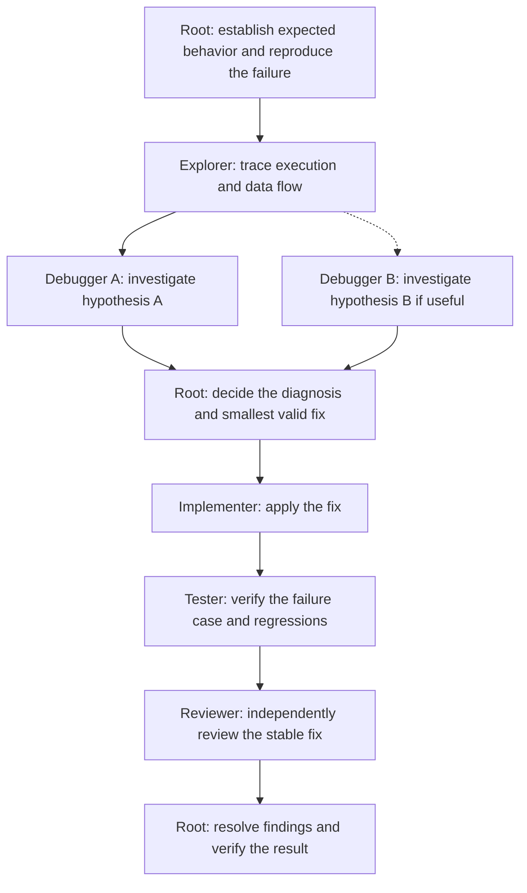
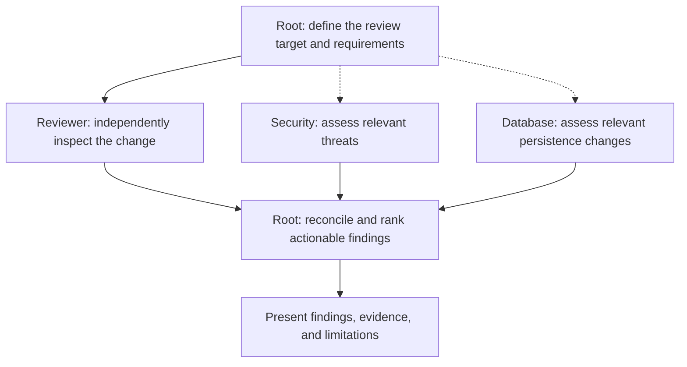
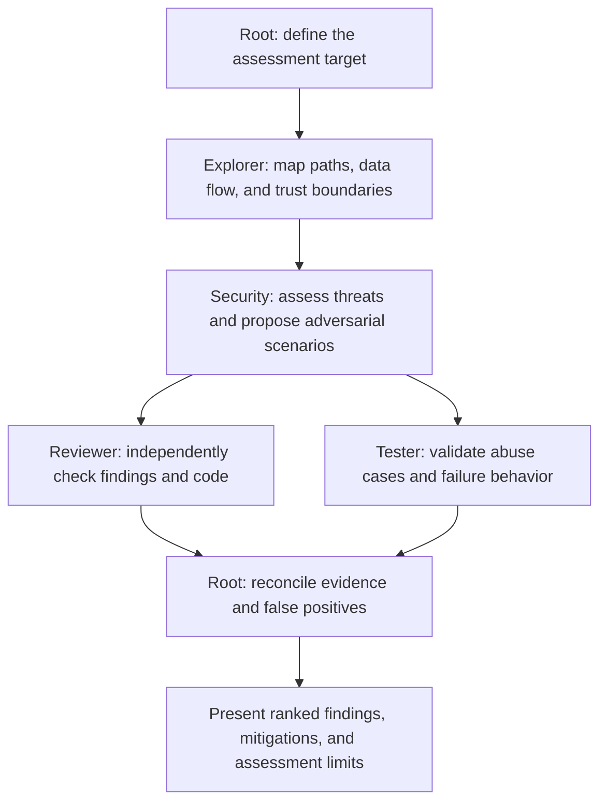
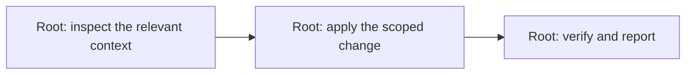

# Agent Rig

Agent Rig gives Codex a consistent engineering process across your repositories. It provides reusable specialist agents, workflows, and presets that you can copy into a project or install globally.

The root Codex agent owns the result. It delegates useful work to specialists, makes the final decisions, and verifies the outcome. Features get independent testing and review; small changes can stay with the root alone.

## Install

From this checkout, install into an existing project folder:

```bash
bin/agent-rig install --target /path/to/project
```

Or install for all your projects:

```bash
bin/agent-rig install --global
```

Both commands install the **full preset** by default: all seven roles and all five workflows. Use `--preset minimal`, `--preset backend`, or `--preset security` to choose a smaller set. Project installs require `--target`; global installs use `$CODEX_HOME`, falling back to `~/.codex`.

Start a new Codex session in your project after installation, then begin a request with a workflow alias:

```text
@feature Add employee bonus calculations.
```

**Agent Rig is opt-in.** Without a leading alias, Codex uses your existing setup and ignores Rig's workflows and roles. Installing the full preset makes specialists available; it does not run every agent on every task.

The installer requires Bash 3.2+ and standard Unix utilities. Use a current Codex release that supports standalone agent TOML files. Existing Codex configuration is preserved, and installed files are editable copies. For previews, updates, and backups, see [installation details](#installation-details).

To remove an installation, use `bin/agent-rig uninstall --target /path/to/project` or `bin/agent-rig uninstall --global`. See [uninstall details](#uninstall) for previews and locally modified files.

## How it works

Agent Rig separates responsibilities so you can reuse the same process while keeping each repository's own conventions:

| Concept | Purpose | Source |
| --- | --- | --- |
| Agent | Defines a specialist's responsibility, boundaries, output, model, and effort | [agents/](agents/) |
| Workflow | Defines the stages and specialists for a type of task | [workflows/](workflows/) |
| Preset | Selects the agents and workflows available in an installation | [presets/](presets/) |
| Project instructions | Define activation, root ownership, and coordination | [templates/AGENTS.md](templates/AGENTS.md) |

Codex follows the installed instructions when handling a request. The root chooses bounded assignments, coordinates file ownership, combines findings, and performs final verification. Subagents support the requested outcome and return their work to the root.



The root normally delegates directly to specialists. Nested subagents require explicit root authorization and a clear benefit.

## Agents

| Agent | Responsibility | Typical output |
| --- | --- | --- |
| [explorer](agents/explorer.toml) | Trace architecture, execution paths, data flow, and dependencies | Relevant files, constraints, risks, and recommended implementation area |
| [implementer](agents/implementer.toml) | Implement the root-approved design within assigned files | Scoped changes, checks, and remaining issues |
| [database](agents/database.toml) | Analyze schema, SQL, migrations, indexes, transactions, and integrity | Persistence findings, migration risks, and verification recommendations |
| [tester](agents/tester.toml) | Independently check requirements, edge cases, regressions, and failures | Meaningful tests, commands and results, defects, and coverage gaps |
| [reviewer](agents/reviewer.toml) | Independently review a stable implementation | Actionable findings ranked CRITICAL/HIGH/MEDIUM/LOW, or a clear report of no findings |
| [debugger](agents/debugger.toml) | Investigate a bounded failure hypothesis using evidence | Supporting and contradicting evidence, diagnosis, and smallest fix recommendation |
| [security](agents/security.toml) | Assess reachable threats, trust boundaries, and abuse cases | Ranked findings, mitigations, adversarial scenarios, and assessment limits |

Installed Codex names use the `agent_rig_` prefix, such as `agent_rig_explorer`. Explorer, database, reviewer, debugger, and security inspect and report without editing project files. Implementer writes assigned implementation files; tester may write separately assigned test files. Root decides which findings to accept and how to resolve them.

## Workflows

Start a request with the alias for the process you want:

| Alias | Use for | Example |
| --- | --- | --- |
| `@feature` | Substantial feature development | `@feature Add employee bonus calculations.` |
| `@bug` | A failure whose cause needs investigation | `@bug Payroll totals are incorrect for this case.` |
| `@review` | Reviewing existing code or a proposed change | `@review Review the latest changes.` |
| `@security` | A security assessment | `@security Review the authentication flow.` |
| `@quick` | Trivial or low-risk changes | `@quick Fix the typo in README.md.` |

Aliases are prompt conventions, not native Codex commands. The standalone token must appear at the start of the request, after optional whitespace. Quoting an alias or mentioning it later does not activate Rig. Activation is checked for each request; a previous alias does not activate a later unprefixed request.

The diagrams below show the normal stages. Dotted branches mark optional work; parallel branches show independent stages. Specialists participate only when useful and installed. Root handles a stage when its specialist is unavailable, and explains any necessary workflow adaptation. Full makes all roles available without requiring every role to participate.

### Feature

Explore the architecture, let root decide the design, implement, then validate independently. Database analysis is useful when the feature affects persistence.



Explorer and database may work in parallel. Tester and reviewer may work in parallel after implementation stabilizes, provided test edits stay outside the review target. Accepted fixes and new tests receive affected testing and follow-up review. See [the feature workflow](workflows/feature.md).

### Bug

Establish the failure, trace its execution path, and investigate separate hypotheses before applying a fix.



Debugger A and B are separate instances of the same role, assigned independent hypotheses that can run in parallel. Use debuggers when the cause remains uncertain, and one when a second adds little value. Root investigates when debugger is absent. An obvious low-risk bug can use quick. See [the bug workflow](workflows/bug.md).

### Review

Review an explicit, stable target. Add security or database expertise when those concerns are relevant.



The selected reviewers may work in parallel. Review reports findings and recommendations; implementation requires a request to fix them. See [the review workflow](workflows/review.md).

### Security

Map trust boundaries, assess threats, then independently review the findings and test relevant abuse cases.



Reviewer and tester may work in parallel. Assessment-only testing uses existing checks or disposable reproductions without persistent source or test edits. Isolate any user-requested test changes from the review target. Requested fixes go through implementation and independent validation. See [the security workflow](workflows/security.md).

### Quick

Keep simple changes with the root: typo fixes, small documentation edits, bounded mechanical renames, and obvious configuration corrections.



Quick does not spawn subagents. If inspection reveals broader effects or uncertainty, root explains and selects the smallest suitable available workflow. See [the quick workflow](workflows/quick.md).

### Parallel work and file ownership

- Run independent architecture exploration and database analysis together when useful.
- Give debugger instances different hypotheses so they do not repeat the same investigation.
- Assign multiple implementers independent areas with disjoint file ownership, such as `internal/payroll/` and `internal/reporting/`.
- Sequence edits when agents need the same files. Review a stable target, and keep concurrent test writes outside it.
- Keep testing and review independent of implementation. Root coordinates corrections, rechecks affected work, and respects the runtime's concurrency limits.

Plan Mode remains planning: workflow stages and delegated tasks do not authorize implementation while that mode is active. Existing permission boundaries and repository conventions continue to apply.

## Presets

| Preset | Available agents | Available workflows |
| --- | --- | --- |
| `full` (default) | explorer, implementer, database, tester, reviewer, debugger, security | feature, bug, review, security, quick |
| `minimal` | explorer, implementer, tester, reviewer | feature, bug, quick |
| `backend` | explorer, implementer, database, tester, reviewer, debugger | feature, bug, review, quick |
| `security` | explorer, security, reviewer, tester, debugger | security, review, bug, quick |

A preset makes roles available; it does not run them all. Minimal uses the root for uncertain diagnosis because debugger is absent. Security uses the root for implementation because implementer is absent. Other absent specialist stages also fall back to the root.

## Installation details

From this checkout:

```bash
# Preview without changing the project.
bash bin/agent-rig install --target ../my-project --dry-run

# Install full into the specified project.
bash bin/agent-rig install --target ../my-project

# Update from this checkout or switch the project's preset.
bash bin/agent-rig install --target ../my-project --preset backend

# Explicitly replace conflicting Rig content, preserving backups.
bash bin/agent-rig install --target ../my-project --preset full --replace-modified

bash bin/agent-rig --help
```

Project installation writes:

```text
project/
├── AGENTS.md                       # Marked Rig section, or AGENTS.override.md
├── .codex/
│   ├── config.toml                 # Comment-only guidance, created when absent
│   └── agents/agent_rig_<role>.toml
└── .agent-rig/
    ├── workflows/<selected-workflow>.md
    ├── manifest.tsv               # Preset and installed-content checksums
    └── backups/<unique-run>/      # Previous versions of changed existing files
```

The installer uses a nonempty `AGENTS.override.md` when present; otherwise it uses `AGENTS.md` and leaves an empty or whitespace-only override untouched. If an override becomes active later, the next install moves the managed section there. This applies to both project and global installations, following the [instruction discovery rules](https://learn.chatgpt.com/docs/agent-configuration/agents-md).

Existing content stays outside the marked Rig section. Updates preserve that surrounding content byte-for-byte, including CRLF line endings. A changed managed section still requires reconciliation or `--replace-modified`, even when the change is only its line endings. Keep repository conventions, build commands, and project-specific requirements outside the section:

```markdown
# Project instructions

Run the project's existing test command. Follow its API conventions.

<!-- agent-rig:begin -->
...installed orchestration instructions...
<!-- agent-rig:end -->

Additional project instructions can also go here.
```

Project workflow paths are relative to the directory containing the installed Rig section, so they also work when Codex starts in a project subdirectory.

## Global installation

```bash
# Preview the global installation.
bash bin/agent-rig install --global --preset backend --dry-run

# Install or update the global preset.
bash bin/agent-rig install --global --preset backend

# Use a custom Codex home.
CODEX_HOME=/path/to/codex-home bash bin/agent-rig install --global --preset full
```

`--global` installs into `${CODEX_HOME:-$HOME/.codex}`, the Codex configuration directory. It is mutually exclusive with `--target`. A missing Codex home is created when applying an installation; `--dry-run` creates no destination files or directories. Presets, updates, backups, local-edit protection, and `--replace-modified` work in both scopes. The manifest records the scope to prevent accidentally mixing project and global layouts in one destination. Existing project manifests without a scope field remain compatible.

```text
codex-home/                         # Usually ~/.codex
├── AGENTS.md                       # Or active AGENTS.override.md
├── config.toml                     # Existing configuration preserved
├── agents/agent_rig_<role>.toml
└── .agent-rig/
    ├── workflows/<selected-workflow>.md
    ├── manifest.tsv
    └── backups/<unique-run>/
```

Codex reads a nonempty global `AGENTS.override.md` before `AGENTS.md`, so the installer adds the managed section to that override when it contains instructions. Otherwise it uses `AGENTS.md` and leaves an empty or whitespace-only override untouched. If an override becomes active after installation, the next install moves the managed section there and preserves surrounding content in both files. Removing or editing a previously managed section remains a protected change; use `--replace-modified` after reconciling it. These paths follow the [official instruction discovery rules](https://learn.chatgpt.com/docs/agent-configuration/agents-md).

Global instructions list absolute workflow paths so Codex can read them from any repository. Rig remains opt-in: unprefixed requests use your existing setup. Repository instructions continue to govern project conventions; when a project also has an Agent Rig installation, its preset and workflow paths take precedence for that project. Start a new Codex session after installation. If you relocate a Codex home, rerun the installer to refresh its absolute workflow paths.

## Uninstall

From this checkout, remove Rig from a project or your Codex home:

```bash
bin/agent-rig uninstall --target /path/to/project
bin/agent-rig uninstall --global
```

Project removal requires an existing `--target`. Global removal uses `${CODEX_HOME:-$HOME/.codex}`, just like installation. Removing a project installation leaves your global installation intact, and removing the global installation leaves project installations intact. Start a new Codex session afterward to reload the updated setup.

The command removes roles and workflows recorded in `.agent-rig/manifest.tsv`, strips the marked Rig section from its recorded `AGENTS.md` or `AGENTS.override.md`, and removes the manifest. It preserves Codex configuration, instructions outside Rig sections byte-for-byte, unrelated agents and workflows, and backup history. Generated comment-only configuration is kept too. Empty instruction files and directories may remain.

```bash
# Preview removals without changing any destination files.
bin/agent-rig uninstall --target /path/to/project --dry-run
bin/agent-rig uninstall --global --dry-run

# Explicitly remove locally customized Rig content, keeping backups.
bin/agent-rig uninstall --target /path/to/project --remove-modified
bin/agent-rig uninstall --global --remove-modified

# Remove Rig from a custom Codex home.
CODEX_HOME=/path/to/codex-home bin/agent-rig uninstall --global
```

Removal stops before writing when a recorded role, workflow, or instruction section has local edits. Reconcile those changes, or use `--remove-modified` to back them up and remove them. Additional Rig-marked sections in the other instruction file also require that flag. Every existing file changed or deleted is saved under `.agent-rig/backups/<unique-run>/`; the command reports that directory. `--remove-modified` is for uninstall, while `--replace-modified` and `--preset` are for install.

Already missing managed files or sections are accepted. Without a manifest, removal reports that no files were removed and leaves the destination untouched, including any untracked Rig copies. Restore a known-good manifest from your backups to recover recorded ownership, or remove those untracked copies manually. Invalid manifests, malformed markers, scope mismatches, and destination symlinks stop removal even with `--remove-modified`. Uninstall shares the install lock and attempts to restore changed files if an operation fails.

## Codex configuration

Existing project `.codex/config.toml` and global `config.toml` remain byte-for-byte unchanged, including on updates and explicit replacements. When absent, the installer creates comment-only guidance, with no active settings that could override the user's configuration. Current Codex discovers standalone project agents in `.codex/agents/` and global agents in the Codex home's `agents/`. If you want Rig workflows and an existing configuration disables multi-agent tools, reconcile it manually: set `enabled = true` in its existing `[agents]` table, or add the table when absent. Avoid duplicate TOML tables. The root's model, reasoning effort, and concurrency settings stay under the user's control; Rig role files specify their own model and effort.

Rig agents use names such as `agent_rig_explorer` and `agent_rig_reviewer` so they do not shadow built-in or existing user roles named `explorer` or `reviewer`. Source filenames and preset entries retain the logical names, such as `agents/explorer.toml`; the installed filename matches the namespaced Codex name.

Use a current local Codex release supporting standalone agent TOML discovery. This setup follows the [official subagent documentation](https://learn.chatgpt.com/docs/agent-configuration/subagents); older releases that require explicit role registration need manual adaptation. Begin a new Codex session after installation and trust the target's project configuration when prompted. Agent Rig cannot override session permissions, disabled tools, or higher-priority instructions.

## Role models and reasoning

Each Rig role pins `model` and `model_reasoning_effort` in its agent TOML file:

| Role | Model | Effort | Selection rationale |
| --- | --- | --- | --- |
| explorer | `gpt-6-luna` | `high` | Efficient repository exploration with bounded responsibilities |
| implementer | `gpt-6.1-sol` | `high` | Strong multi-step coding at a practical cost |
| database | `gpt-6.1-sol` | `high` | Schema, transaction, and migration reasoning |
| tester | `gpt-6.1-sol` | `high` | Independent edge cases, regressions, and test authoring |
| debugger | `gpt-6-astra` | `high` | Ambiguous causes and competing hypotheses |
| reviewer | `gpt-6-astra` | `high` | Independent judgment about subtle defects |
| security | `gpt-6-astra` | `high` | Adversarial reasoning and trust boundaries |

These are Agent Rig's recommended starting defaults, selected on October 4, 2026 from the [official model-selection guidance](https://developers.openai.com/api/docs/guides/model-selection): Luna for focused work, Sol for complex work with cost considerations, and Astra for demanding reasoning. The role assignments are our judgment, not per-role benchmarks. `high` gives specialists room to trace logic and check assumptions without defaulting every delegation to `xhigh` or `max`; compare those higher efforts on representative tasks before adopting them. The [subagent documentation](https://learn.chatgpt.com/docs/agent-configuration/subagents) explains model settings and their precedence.

The root keeps the model and effort chosen in the user's existing setup, including for `@quick`. These role settings apply when a namespaced Rig role is spawned for an activated workflow. Requests without a workflow alias continue to use the existing setup. Multiple instances of a role use the same role configuration, including explicitly authorized nested subagents.

Models must be available to the account and client using the target project; configuration validation does not confirm account access. To use another model, edit that role's `model` and `model_reasoning_effort` together. Removing both keys restores inheritance. Local changes remain protected during updates.

## Customization and conflicts

Sources live in `agents/`, `workflows/`, `presets/`, and `templates/`. Presets list shared definitions rather than duplicating them. Edit sources here to change defaults for future installations, or edit installed copies to customize one project or your global setup. Per-role models and efforts can be changed in the installed TOML files; supported settings are documented in the [Codex configuration reference](https://learn.chatgpt.com/docs/config-file/config-reference).

The manifest records checksums for installed roles, workflows, and the marked instruction section. Identical unmanaged copies can be adopted. If an installed file or section already matches the current source, an update refreshes its manifest entry without replacing that content. Changed existing files are backed up before replacement. A repeat install stops before writing if it finds differing local edits or unmanaged destinations; reconcile them manually or use `--replace-modified`. That option replaces conflicting selected content and removes conflicting obsolete managed files when switching presets, with backups. It still preserves existing Codex configuration and instructions outside the section.

Preset switches remove only previously managed roles and workflows no longer selected. Manifest agent paths are limited to Rig's namespace and recognized legacy project role names. Unrelated project files remain. Missing managed files are recreated; a removed instruction section is treated as a protected local edit. Malformed markers, unsafe manifest paths, and destination symlinks require manual reconciliation and cannot be overridden by the replacement flag.

Updates from an earlier install migrate unchanged managed roles to the `agent_rig_` namespace, backing up the previous files; modified roles remain protected. Existing Codex configuration is still preserved. If an earlier Rig install created an active `[agents] enabled = true` setting, remove that setting manually when you prefer to inherit the user's configuration instead.

Commit the installed instruction, agent, workflow, and manifest files if you want teammates to share the setup. Backup files are local history; add `.agent-rig/backups/` and `.agent-rig/.install-lock/` to the target project's ignore rules yourself if desired. The installer does not edit the project's `.gitignore`.

Install and uninstall stage and check changes before writing, use a shared lock during application, and attempt to restore originals on a write failure. Writes use temporary files. Backups are retained, and newly created empty directories can remain after failure. Avoid editing installation destinations during a run. A leftover `.agent-rig/.install-lock` after a terminated process requires confirming no install or uninstall is running before removing the lock. This is a local copy tool, not a synchronization service or a transactional filesystem.

## Verification

Check the entire project with one command:

```bash
make check
```

Development checks require Make and Python 3.11+ for TOML validation. Install and uninstall still use only Bash and standard Unix utilities. You can also run the checks individually:

```bash
for script in bin/agent-rig tests/*.sh; do bash -n "$script" || exit 1; done
python3 tests/validate.py
bash tests/install.sh
bash tests/uninstall.sh
```

The source checker validates agent TOML fields, names and model settings, preset memberships and references, the complete full preset, inherited configuration, Markdown fences and local links, and source formatting. It validates configuration structure without contacting model services or checking account access.

Installer tests use disposable projects, Codex homes, and source fixtures under the temporary directory, without changing your actual Codex installation. They cover every preset in both scopes, opt-in instructions, namespace isolation and migration, inherited configuration, updates, preset switching, preserved content and CRLF markers, collision handling, protected local edits, backups, dry runs, symlink/manifest rejection, locking, and simulated mid-install write failures. Both scopes cover override discovery and transitions. Global cases also cover `CODEX_HOME`, the `HOME/.codex` fallback, absolute workflow paths, and scope conflicts.

Uninstall tests also use disposable destinations. They cover all presets in both scopes, exact preservation of user files and instruction bytes, local-edit protection and explicit removal, backup history, repeat removal and reinstallation, override files, missing content, legacy manifests, absent source templates, unsafe paths, locks, and simulated mid-uninstall failures that must restore deleted files and their permissions.

For a Codex smoke check, install `minimal` into a disposable project, open a new Codex session there, and ask:

```text
@feature Explore this repository and propose a feature plan without edits.
Spawn agent_rig_explorer to identify the relevant project files. Report which
Rig roles and workflows are available and wait for its findings.
```

Confirm the namespaced explorer is available and returns its structured report. Then try `@quick` on a small documentation change and confirm it stays root-only. In a new request without a prefix, ask to explain the project entrypoint and confirm the user's existing process applies without reading Rig workflows or spawning Rig roles. If tools are unavailable, inspect existing configuration and session restrictions; the installer does not launch model sessions itself.
